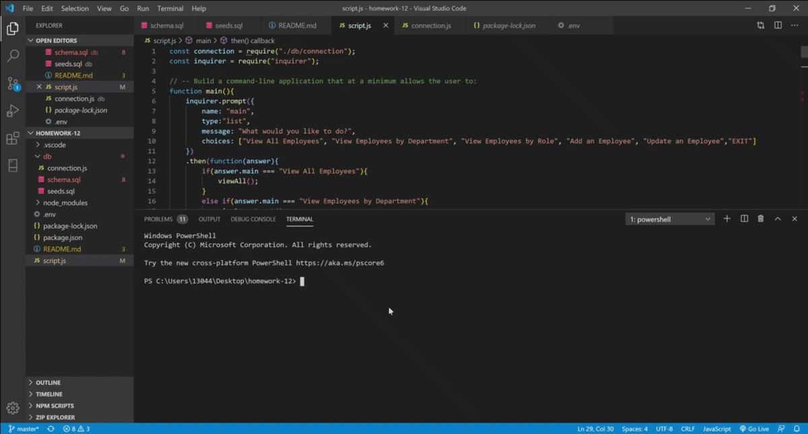

# Made by Warsurge  


## Homework-12

# Employee Tracker

## Description 
```
As a business owner
I want to be able to view and manage the departments, roles, and employees in my company
So that I can organize and plan my business
```
        
## Installation
npm install
        
## Usage 
This app is used for keeping a database of employees. It is able to view and add new employees as needed.
        
## GIF


        
        
